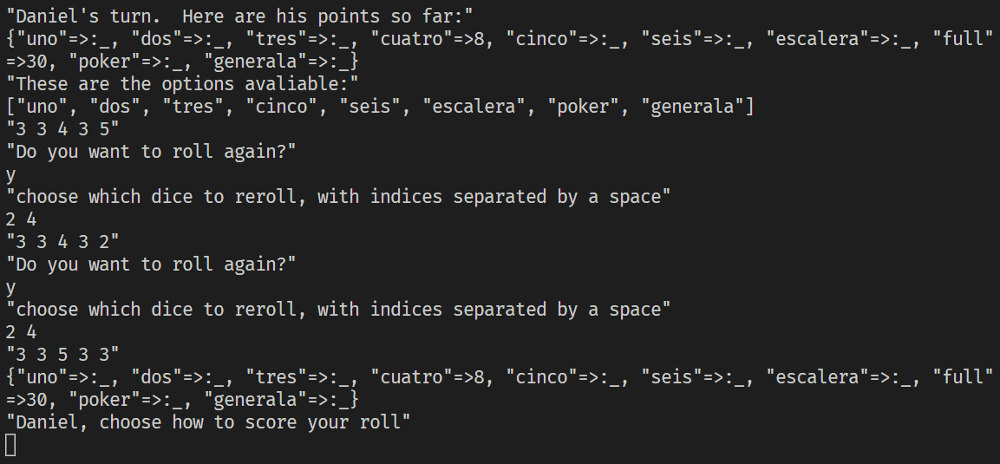

# Games

I enjoy playing board games and playing around wih new functions, so this repository is made up of games I've tried to build.  I like learning new games from around the world, so some of these are not well-known games.

Not all are finished, none of them are styled heavily, but all of them not marked as "in progress" should be functional.

I did the bulk of the work for some of these when I was first starting with Ruby and OOP.  My other projects are a better measure of my current skills and style, but this shows some of the extra work I do for fun.

## Generala

The first game I write here, Generala, is essentially a variant of Yahtzee popular in South America.  I write this while I was first learning about object-oriented programming.  My original version had long, complicated functions -- I later refactored it to use a lot of helper functions, as you can see from the score function.

```
    def score(player,hand,choice)
        nums = ['uno', 'dos', 'tres', 'cuatro', 'cinco', 'seis']
        if nums.include?(choice)
            score_num(player,hand,choice)
        elsif choice == 'escalera'
            score_escalera(player,hand,choice)
        elsif choice == 'full'
            score_full(player,hand,choice)
        elsif choice == 'poker'
            score_poker(player,hand,choice)
        else
            score_generala(player,hand,choice)
        end
        player.available.reject! { |ele| ele == choice }
        true
    end
```

A sample round of the game is here: as you can see, it runs correctly and communicates the necessary information, but the UI is pretty ugly because I made no attempt at styling.

